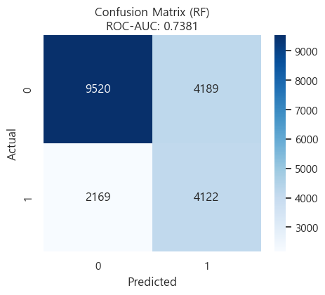
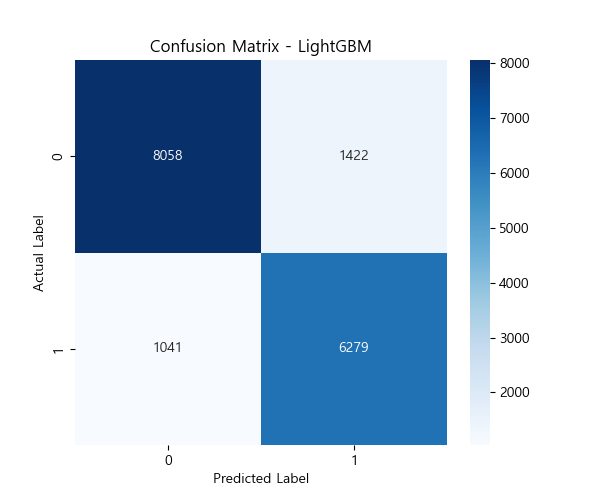
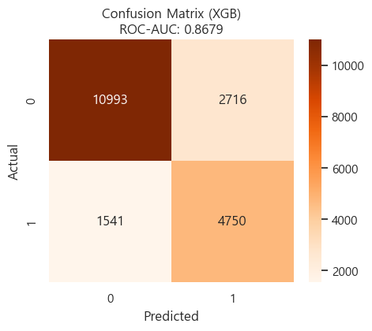

데이터 기반 카드 고객 이탈 징후 탐지 및 차별화된 리텐션 전략 구축

# 데이터 개요
- 데이터 출처 : AIHub 금융 합성 데이터 
- 데이터 구성 : 회원, 신용, 승인매출, 청구, 입금, 마케팅 정보 등 총 14개 시트 
- 데이터 형태 : 발급회원번호를 결합 키(KEY)로 활용하는 구조화된 엑셀(.xlsx) 데이터 
- 데이터 특징 : 개인정보 비식별 조치 완료 및 고객의 인구통계학적 특성과 시계열적 소비 행태를 포함한 패널 데이터 
- 데이터 파일 다운로드 : <a href="https://drive.google.com/drive/folders/1hcDjfI612Sz83Mik_sVEyifFs7vmi3at?usp=drive_link">파일 다운로드</a>

# 문제 정의 및 가설 설정 
- 현황 분석 : 기존의 사후적 이탈(해지 후 대응) 관리 체계의 한계점 도출 
- 가설 수립 : "고객 등급별로 이탈의 징후는 다를것이며 소비 급감은 해지의 선행 지표이다"라는 가설 설정 
- 차별화 전략 : VIP와 General 고객을 분리하여 각기 다른 이탈 정의(Target) 적용 

# 데이터 파이프 라인 구축 및 전처리 
- 데이터 통합 : 14개 시트의 금융 합성 데이터를 회원번호 기반으로 병합하여 마스터 데이터셋 구축 
- 데이터 정제 : 금융 데이터 특성을 고려한 결측치 처리 및 이상치(극단적 고액 결제 등) 필터링 
- 누수 차단 : 예측 시점 이후의 정보가 학습 데이터에 포함되지 않도록 데이터 시점 분리 

# 타깃 정의 
- VIP 고객 
    - 데이터 정렬 및 구조화 : 발급회원번호와 기준년월을 기준으로 데이터를 정렬하여 시계열 분석 데이터 셋의 연속성 확보 
    - 이용 금액 통합 : 신용카드 및 체크카드 이용 금액을 합산하여 고객별 '당월 총 이용 금액' 산출 
    - 기준 지표 설정 : 최근 3개월간의 평균 이용 금액을 계산하여 개별 고객의 평소 소비 패턴을 기준점으로 정의 
    - 이탈 징후 판단 로직 
        - 이탈(1) : 당월 총 이용 금액이 직전 3개월 평균 이용 금액의 80% 미만으로 급감한 경우 (소비 위축 징후 포착)
        - 유지(0) : 직전 평균 이용 금액의 80% 이상 수준을 유지하며 정상적인 소비 활동을 지속하는 경우 
    - 데이터 필터링 및 노이즈 제거 : 
        - 직전 3개월 평균 이용 금액이 없거나 '0원'인 고객은 '장기 휴면' 또는 '신규 고객'으로 간주하여 학습 대상에서 제외 
        - 이를 통해 모델이 실제 '이용 중인 고객'의 이탈 징후에만 집중할 수 있도록 데이터 품질 최적화
    - 학습 데이터 구성 : 타겟 라벨(0, 1)이 확정된 데이터만을 추출하여 최종 학습용 마스터 데이터셋 구축 

- General 고객
- 종합 상태 점수(Status Score) 산출 
    - 악성 부채 점수 : 현금서비스 잔액 증감률(가중치 1.5)과 카드론 잔액 증감률(가중치1.0)을 합산하여 부채 리스크 측정 
    - 연체 강도 점수 : 최근 1개월(3.0), 2개월 전(2.0), 3개월 전(1.0)의 연체 잔액에 가중치를 부여하여 상환 능력 수치화 
    - 활동성 점수 : 최근 3개월 건수 합계와 6개월 건수 합계를 비교하여 활동성 저하 여부 판단
    - 최종 상태 점수 : (부채 점수 + 연체 점수) - (활동성 점수 + 자산 점수)로 계산 
- 시계열 기울기 점수(Slope Score) 산출
    - 2개월 이상 데이터 : 선형 회귀를 통해 이용 금액, 잔액, 이용 건수의 기울기 계산 
    - 1개월 데이터(R12M 보완) : 현재 시점 데이터와 최근 12개월 평균값(R12M/12)의 차이를 계산하여 하락 여부 판단(잔액은 항상 만족하는 것으로 간주)
- 이탈 위험 타깃 정의(Target 1)
    - 필수 조건(AND) : 이용 금액, 잔액, 이용 건수의 기울기가 모두 0 이하 일 것
    - 위험 징후 (OR) : 4대 위험 항목(부채 증가, 연체 발생, 활동성 마이너스, 자원 0원) 중 1개 이상 감지될 것 
- Rolling 역추적 분석 
    - 현재 이탈로 판정된 고객에 대해 한 달씩 과거로 돌아가며 동일한 이탈 조건을 만족하는지 확인하여 연속 이탈 징후 기간을 개월 단위로 산출 

# 모델링 및 운영 최적화 
1. 계층적 모델링 전략 
- 실험 설계 : 고도화된 타켓 테이블에 대해 딥러닝(FT-Transformer)과 머신러닝(LightGBM, XGBoost, RandomForest) 모델을 병렬 학습함
- FT-Transformer의 역할 : 정형 데이터 예측에 특화된 딥러닝 모델인 FT-Transformer의 성능(Recall, AUC)을 상한선으로 설정함 
- 머신러닝 최적화의 필요성 
    - 가중치 및 피처 제어의 한계 : 딥러닝 모델은 개별 변수의 영향력을 직접 제어하거나 특정 비즈니스 로직을 가중치에 반영하기 어려움
    - 운영 효율성 : 실시간 배치 예측 환경에서 머신러닝 모델이 자원 소모량 대비 추론 속도가 월등히 빠름 
2. 모델별 성능 비교 및 최종 선정
- 비교 분석 결과 : FT-Transformer의 점수를 추적하며 머신러닝의 파라미터를 튜닝한 결과, LightGBM이 딥러닝 수준의 성능에 근접하며 가장 우수한 결과를 보임. 
- 최종 선정 모델 : LightGBM
    - 선정 이유 : 학습 속도가 빠르고 과적합 방지 로직이 우수하며, SHAP 등을 활용한 변수 해석력이 매우 뛰어나 리텐션 전략 수립에 최적임 
3. 하이퍼파라미터 및 손실 함수 최적화 
- Recall 중심 최적화 : 이탈자를 놓치지 않는 것이 비즈니스 목표이므로 Scale_pos_weight 조절 및 F1-Score 기반 튜닝을 통해 재현율(Recall) 극대화 
- 조기 종료 : 검증 데이터셋의 손실을 모니터링하여 최적의 반복 횟수를 결정하고 일반화 성능 확보

# 분석 결과 및 전략 제언 
- SHAP 기반 모델 해석 및 핵심 변수 도출
    - 공통 징후 : 두 그룹 모두 특정 업종에서의 매출 감소보다 해당 고객의 주 이용 카테고리(쇼핑, 외식, 교통 등)에서의 소비 급감이 가장 강력한 이탈 신호로 작용 
    - VIP 그룹 : 주력 소비 카테고리의 매출 하락 시, 타사 프리미엄 카드로의 이탈 가능성이 매우 높음 
    - General 그룹 : 주력 소비 카테고리의 활동성 저하가 전체적인 카드 이용 중단(휴먼)으로 이어지는 경향 확인 
- 등급별 맞춤형 리텐션 전략 
    - 전략 핵심 : 고객별 소비 데이터 분석을 통해 선호 카테고리를 추출하고 해당 카테고리에 특화된 혜택을 처방 
    - VIP 케어 전략(고가치 혜택)
        - 처방 : 주 이용 카테고리 대상 고액 할인 바우처, 포인트 적립률 대폭 상향, 전용 프리미엄 서비스 결합 혜택 제공 
        - 목적 : 타사 이동 방지 및 '우량 고객'으로서의 심리적 만족도 극대화 
    - General 케어 전략(실속형 혜택)
        - 처방 : 주 이용 카테고리 대상 맞춤형 할인 쿠폰 발행, 무이자 할부 혜택 제공, 소액 포인트 개시백 이벤트 실시 
        - 목적 : 카드 활동성 유지 및 주 이용 카드 지위 방어 
    - 리스크 병행 관리 : 두 그룹 공통으로 연체 징후나 한도 소진율 급증 시에는 리볼빙 안내 등 금융 서비스 처방을 유연하게 병행 
- 비즈니스 기대 효과 
    - 마케팅 반응률 제고 : 고객이 실제로 자주 사용하는 분야의 혜택을 제공함으로써 무분별한 쿠폰 발행 대비 높은 반응 유도 
    - 비용 효율성 최적화 : 모든 고객에게 동일한 혜택을 주는 대신 등급과 선호도에 따른 차등 보상을 통해 마케팅 예산 효율적 집행 

# 한계점 및 향후 과제 
- 타깃 정의의 정합성 및 검증 한계
    - 라벨 노이즈 발생 : 합성 데이터 특성상 실제 해지 라벨이 부재하여 사용량 급감 및 상태 점수 기반의 규칙 타깃을 설계함 
    - 성능 상한 제한 : 직접 설계한 타깃의 라벨 노이즈가 모델 성능의 상한을 제한할 가능성이 존재하며 실제 이탈과의 인과관계 검증이 필요함 
- Precision-Recall 트레이드오프에 따른 운영 효율성 
    - 재현율(Recall) 중심 최적화 : 미탐지(FN)최소화를 최우선 목표로 설정함에 따라 일부 구간에서 정밀도(Precision)가 상대적으로 낮아지는 구조적 현상 발생 
    - ROI 최적화 과제 : 이탈 징후 탐지 성능은 확보했으니 오탐지(FP)로 인한 불필요한 캠페인 비용 발생 등 마케팅 비용 대비 효율(ROI) 분석 단계까지는 연결하지 못함 
- 피처 파이프라인 및 데이터 관리 리스크 
    - 운영 복잡성 증가 : 다수의 데이터 시트 통합 및 시계열 파생변수 생성 과정에서 컬럼 수가 폭발적으로 증가함
    - 유지보수 부담 : 피쳐 누수 차단, SHAP 기반 변수 압축, 실험 재현성 확보 과정에서 학습 효율(시간/메모리) 및 운영 배포 안정성 측면의 리소스 부담 상존
- 실질적 비즈니스 입팩트 검증 미흡 
    - 평가 지표의 국한 : 현재 분류 모델의 통계적 성능 지표(Recall, AUC 등) 확인 및 마케팅 프레임워크 제시에 집중함 
    - 후속 검증 필요 : 실제 운영 환경에서의 증분 효과 측정, 캠페인 집행 비용 대비 순이익 검증 등 비즈니스 성과와 직결되는 실증적 분석은 향후 과제로 남음
# 개선 방향 및 향후 과제 
1. 실데이터 기반 이탈 정의 다각화 
- 운영 목적별 타겟 버전 병렬 정의 및 비교 
    - 타겟A(해지/탈회) : 카드 계약 종료 이벤트 기반 정의. 정답이 명확하나 사전 징후 포착보다는 사후 대응적 성격이 강함 
    - 타겟B(휴면/비활성) : N개월 연속 결제 건수/금액 0건 기준. 실무적 활용도가 높으나 계절성 및 일시적 비사용 노이즈 포함 가능성 상존.
    - 타겟C(사용량 급감) : 직전 3개월 평균 대비 당월 사용액이 급락(예:70% 이하)하고 회복이 없는 경우. 사전 징후 탐지에 최적화되어 있으나 라벨 노이즈 검증이 필수적임 
2. 타겟 정합성 검증 체계 고도화 
    - 라벨 안정성 및 노이즈 점검 : 동일 고객 대상 타겟A/B/C 간 일치율 및 분포 비교를 통해 특정 구간(연휴, 이벤트 등)에서의 라벨 흔들림 확인.
    - 비즈니스 일관성 체크 : 이탈 라벨링 고객이 실제 사용액 감소, 연체/대출 잔액 변화, 한도 소진율 급증 등 '이탈 전조 증상'을 동반하는지 확인-결과 관계 확인.
3. 이탈 원인 카테고리화 및 처방 정교화 
- 행동 가능한 원인 분류 
    - 활동성 급감형 : 결제 건수 및 매출액 급락, 디지털 채널 이용 감소 고객
    - 현금흐름 악화형 : 대출성 잔액 증가 및 리볼빙/카드론 의존도 심화 고객
    - 연체 위험형 : 연체 징후 포착 및 한도 부족에 의한 승인 거절 발생 고객
    - 관계 약화형 : 핵심 프리미엄 서비스 반응도 저하 및 주요 혜택 이용률 감소 고객
    - 가격 민감형 : 특정 혜택 종료 시점 매출 급감 및 경쟁사 프로모션 이동 의심 고객 
- 원인별 맞춤형 리텐션 연결 : 각 원인 카테고리에 최적화된 마케팅 처방을 매핑하여 실제 비즈니스 임팩트 강화 
4. VIP 고객 특화 이탈 정의 및 전용 지표 개발 
- VIP 전용 타켓(Target D)설계 : VIP 고객의 경우 단순 소비 총액 변화 외에 '프리미엄 서비스(바우처, 라운지, 발렛 등) 이용 빈도 급감'을 핵심 선행 지표로 설정함 
- 초우량 고객 이탈 징후 탐지 : VIP 등급 내에서도 특정 타겟(예 : 사용량 70% 급감 타겟)에 가중치를 부여하여 이탈 시 비즈니스 타격이 큰 초우량 고객에 대한 '조기 경보 시스템'구축 
- 등급별 차별화 지표 : General 고객은 '연체/부채'등 리스크 지표가 중요하지만 VIP 고객은 '라이프스타일 혜택 반응률'을 핵심 변수로 활용하여 활용하여 정합성을 높임. 

# 기술 스택 
- 언어 및 라이브러리 : Python(Pandas, NumPy, Scikit-learn)
- 모델링 : FT - Transformer(PyTorch), LightGBM, XGBoost
- 해석 및 시각화 : SHAP, Feature Importance, Matplotlib, Seaborn
- 협업 및 관리 : Git, GitHub, Google Colab

# 파생변수 점수 분포 확인

# RF_혼돈행렬 확인 

# LightGBM_혼돈행렬 확인 

# XGB_혼돈행렬 확인 

# Streamlit 대시보드 구현
https://github.com/user-attachments/assets/62ca1275-9832-4091-8be6-a2ecdb5a751d
